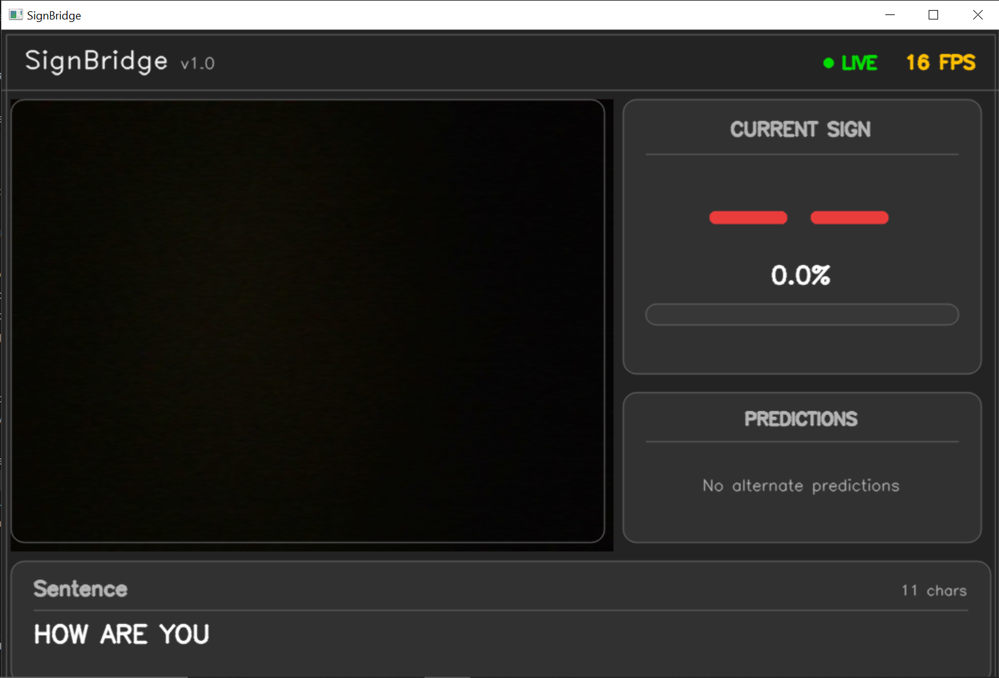
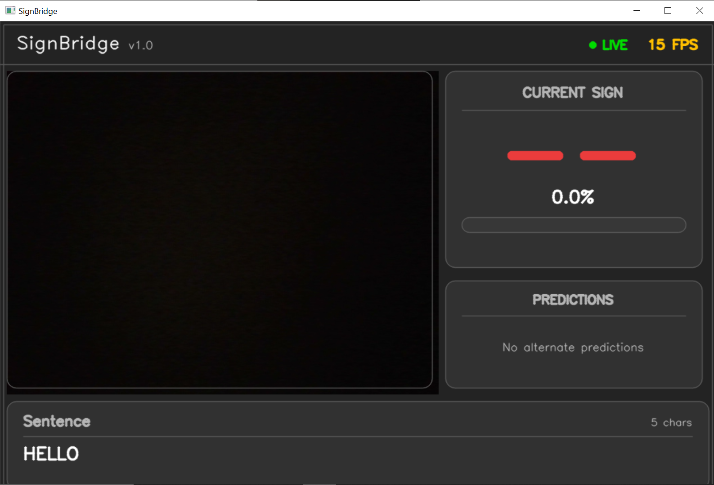

# SignBridge

> Real-time American Sign Language (ASL) recognition using MediaPipe, OpenCV, and Machine Learning.

SignBridge is a desktop application that recognizes American Sign Language gestures in real time using a webcam. The system combines MediaPipe hand tracking with a Random Forest classifier to identify ASL alphabet gestures and converts them into readable text through a live sentence builder.

Built with a modular architecture, SignBridge demonstrates the complete machine learning workflow—from data collection and preprocessing to model training and real-time inference.

---

## Screenshots

### Home Screen

```md

```

### Sentence Builder

```md

```

```md

```

---

# Features

- Real-time ASL alphabet recognition
- MediaPipe-based 3D hand landmark detection
- Landmark normalization for improved accuracy
- Random Forest gesture classification
- Confidence-based prediction visualization
- Live sentence generation
- Modern OpenCV desktop interface
- Modular and extensible project structure
- Dataset recording utility
- Model training pipeline
- Easy support for adding new gestures

---

# Architecture

```
                    Webcam
                       │
                       ▼
             MediaPipe Hand Detection
                       │
                       ▼
              21 Hand Landmarks
                       │
                       ▼
            Landmark Normalization
                       │
                       ▼
            Random Forest Classifier
                       │
                       ▼
         Prediction + Confidence Score
                       │
                       ▼
             Sentence Builder
                       │
                       ▼
                OpenCV Interface
```

---

# Project Structure

```
SignBridge
│
├── src/
│   ├── camera/
│   ├── config/
│   ├── detector/
│   ├── inference/
│   ├── sentence/
│   ├── training/
│   ├── ui/
│   ├── utils/
│   ├──config.py
│   └── main.py
│
├── docs/
│   ├── screenshots/
│   └── demo/
│   
│
├── dataset/
├── models/
├── README.md
├── requirements.txt
└── .gitignore
```

---

# Installation

Clone the repository.

```bash
git clone https://github.com/NaV456727/SignBridge.git

cd SignBridge
```

Create a virtual environment.

```bash
python -m venv venv
```

Activate it.

### Windows

```bash
venv\Scripts\activate
```

### Linux / macOS

```bash
source venv/bin/activate
```

Install dependencies.

```bash
pip install -r requirements.txt
```

---

# Dataset

The repository does **not** include the dataset or trained model.

Download the ASL Alphabet dataset from Kaggle:

**https://www.kaggle.com/datasets/grassknoted/asl-alphabet**

Extract the dataset into:

```
dataset/
```

---

# Training the Model

Convert the dataset into landmarks.

```bash
python -m src.training.dataset_converter
```

Train the Random Forest classifier.

```bash
python -m src.training.train_model
```

This generates:

```
models/
└── gesture_model.joblib
```

---

# Running the Application

```bash
python -m src.main
```

Once launched:

1. Position one hand inside the camera frame.
2. Hold an ASL gesture steadily.
3. Wait for the prediction to stabilize.
4. The detected characters are automatically appended to the sentence builder.

---

# Machine Learning Pipeline

The classifier uses:

- MediaPipe Hands
- 21 three-dimensional landmarks
- Landmark normalization
- Random Forest Classification

Feature preprocessing:

- Wrist-centered translation
- Scale normalization using the wrist-to-index MCP distance
- Consistent preprocessing during both training and inference

---

# Technologies Used

### Programming

- Python

### Computer Vision

- OpenCV
- MediaPipe

### Machine Learning

- Scikit-learn
- NumPy
- Pandas
- Joblib

---

# Future Improvements

- Dynamic gesture recognition
- Word-level prediction
- Transformer-based sequence models
- Language model integration
- Speech synthesis
- Left-hand optimization
- Mobile deployment
- TensorFlow Lite inference
- Multi-language sign support

---

# Contributing

Contributions, feature requests, and bug reports are welcome.

Feel free to fork the repository and submit a pull request.

---

## Author

**Abhinav Dahake**

LinkedIn: https://www.linkedin.com/in/abhinav-dahake-8096282ab/
